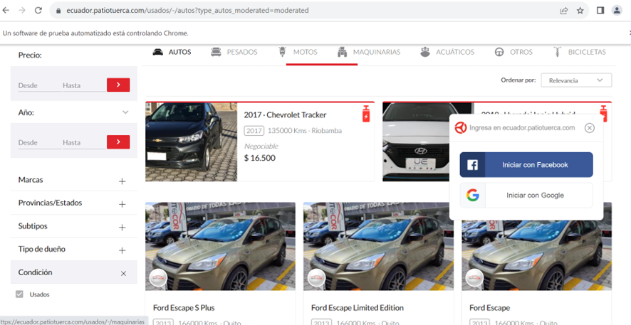
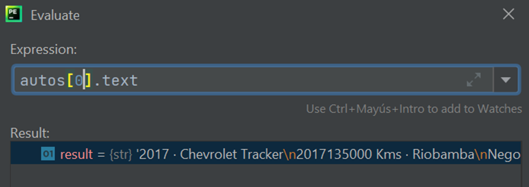
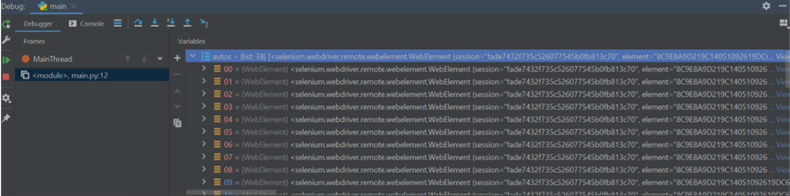
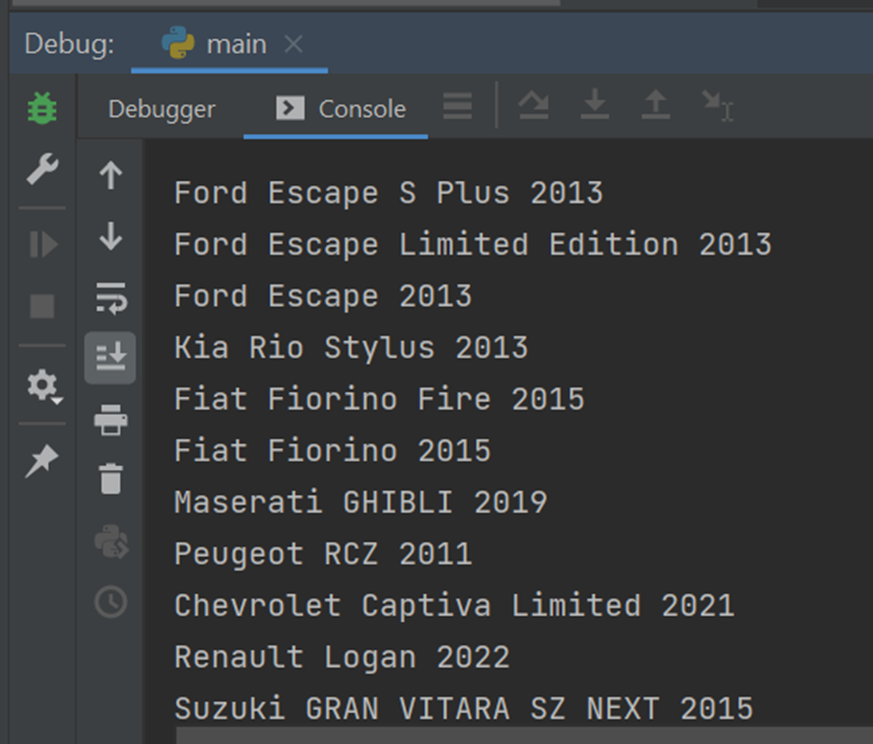
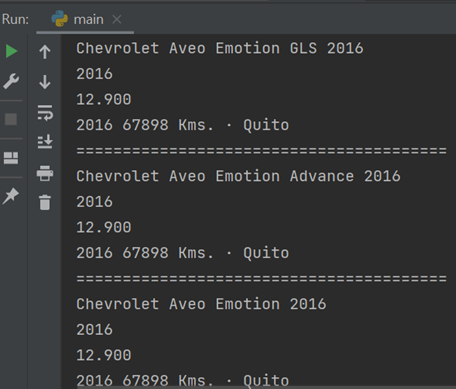
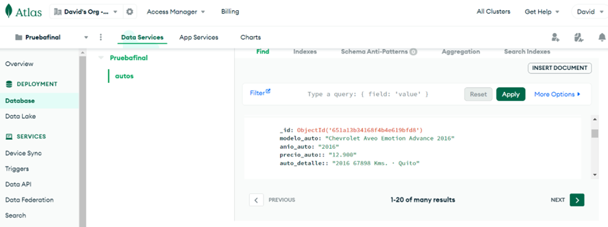

# Tratamiento de datos - pruebafinal.com
Proyecto final de Tratamiento de datos con Selenium - Autos usados Patiotuerca

## Descripción
Se define extraer datos de una fuente de datos online, en este caso se realiza
la extracción de datos de una empresa de Ecuador que se dedica a la venta
de automóviles de segunda mano, con la finalidad de realizar el tratamiento de datos,
como los modelos de autos, sus precios, su año de fabricación. La información
extraída se almacena en una base de datos MongoDB. Como segunda parte de la prueba
se crea un servicio web para manejar esta data extraída.
Se escoge la página online de la empresa Ecuador - Patiotuercas

https://ecuador.patiotuerca.com/usados/-/autos

## PASO 1. Configuración de librería
Crear un archivo `requirements.txt`

Contenido de archivo `requirements.txt`:
```
selenium
pymongo
python-dotenv
```

Instalar las librerías ejecutando desde el terminal:
```
pip install -r requirements.txt
```
## PASO 2. Creación Base de datos MongoDB 
Se genera una base de datos gratis en MongoDB, la misma que almacenará
la información extraída.

Para generar la base de datos es necesario ingresar a la siguiente URL:
https://cloud.mongodb.com/

Se recomienda generar una base de datos en la nube ubicada en Azure y que sea Free.

Se define las credenciales de la BDD:
Usuario: `User`
Contraseña: `Password`


## PASO 3. Configuración archivo .env
Se genera el archivo `.env` donde se presenta la configuración de la base de datos.

El archivo cuenta con el siguiente contenido:
```
MONGO_USER=User
MONGO_PASSWORD=Password
MONGO_HOST=cluster.base.mongodb.net
```

## PASO 4. Configuración archivo mongo.py
Se genera el archivo `mongo.py` el mismo que permite la conexión
de la base de datos con el proyecto ejecutado pycharm, específicamente
con el archivo `main.py`.

El archivo `mongo.py` cuenta con el siguiente contenido:

```
from pymongo.mongo_client import MongoClient
from pymongo.server_api import ServerApi

import os
from dotenv import load_dotenv

load_dotenv()

class MongoConnection:
    def __init__(self):
        user = os.getenv("MONGO_USER")
        password = os.getenv("MONGO_PASSWORD")
        db_hostname = os.getenv("MONGO_HOST")
        uri = f"mongodb+srv://{user}:{password}@{db_hostname}/?retryWrites=true&w=majority"

        # Create a new client and connect to the server
        self.client = MongoClient(uri, server_api=ServerApi('1'))

    # Send a ping to confirm a successful connection
    def test_connection(self):
        try:
            self.client.admin.command('ping')
            print("Pinged your deployment. You successfully connected to MongoDB!")
        except Exception as e:
            print(e)

if __name__ == "__main__":
    MongoConnection().test_connection()
```

## PASO 5. Configuración archivo main.py
Este es el archivo principal que extrae toda la información
de la página de Patiotuercas. 

El archivo `main.py` cuenta con lo siguiente:

```
from selenium import webdriver
from selenium.webdriver.common.keys import Keys
from selenium.webdriver.common.by import By

from mongo import MongoConnection

db_client = MongoConnection().client
db = db_client.get_database('Pruebafinal')
col = db.get_collection('autos')

driver = webdriver.Chrome()
driver.get("https://ecuador.patiotuerca.com/usados/-/autos?type_autos_moderated=moderated")
autos = driver.find_elements(By.CLASS_NAME, value="vehicle-container")
for a in autos:
    auto_name = a.find_element(by=By.TAG_NAME, value="img").accessible_name
#    auto_modelo = driver.find_element(by=By.CLASS_NAME, value='module').text
    auto_detalle = a.find_element(by=By.CLASS_NAME, value='year').text
    auto_precio = a.find_element(by=By.CLASS_NAME, value='price-text').text
    auto_negociable = a.find_element(by=By.CLASS_NAME, value='latam-secondary-text').text

    document = {
        "modelo_auto": auto_name,
        "anio_auto": auto_detalle,
        "precio_auto:": auto_precio,
        "auto_detalle:": auto_negociable
    }
    col.insert_one(document=document)


    print(auto_name)
#    print(auto_modelo)
    print(auto_detalle)
    print(auto_precio)
    print(auto_negociable)
    print('='*40)

   # detalle = a.find_element(by=By.CLASS_NAME, value="vehicle-href")
# elem.clear()
# elem.send_keys("pycon")
# elem.send_keys(Keys.RETURN)
driver.close()
```

## Evidencias
Se presentan las evidencias del presente proyecto:

- Página Online Patiotuercas donde se extraerá la informacion:


- Evidencia de información extraída.




- Ejecución de la primera extracción de información:


- Se genera un correcto formato de la información extraída.


- Evidencia de información aislada en Base de datos:


## Conclusión
1. Se extrae la información de manera correcta.
2. Se almacena la información extraída en una base de datos.
3. Se especifica todo el procedimiento en el archivo README.md
